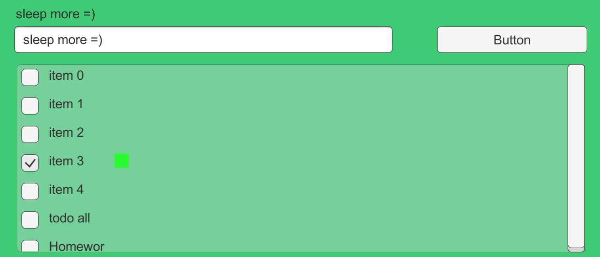

# Unity TODO Comparison

Try to implement TODO in Unity using different data-binding framework or design patterns.

### Implementations

- [MVP + UniRx](https://developers.cyberagent.co.jp/blog/archives/4262/) -> [Sample](./Assets/TodoMvp)
- [Bindingsrx](https://github.com/grofit/bindingsrx) -> [Sample](./Assets/TodoBindingsrx)
- [DataBinding](https://github.com/tinrab/DataBind) -> [Sample](./Assets/TodoDataBind)
- [MarkLight](http://www.marklightforunity.com/) -> [Sample](./Assets/TodoMarkLight)

### Contents

Every TODO implementation requiring same features to be compare easily.

- Typing in `InputField` will show the same text above.
- Click the `Button` to add TODO to the list.
- Click the `Toggle` in the list to show the greenbox on the right.

